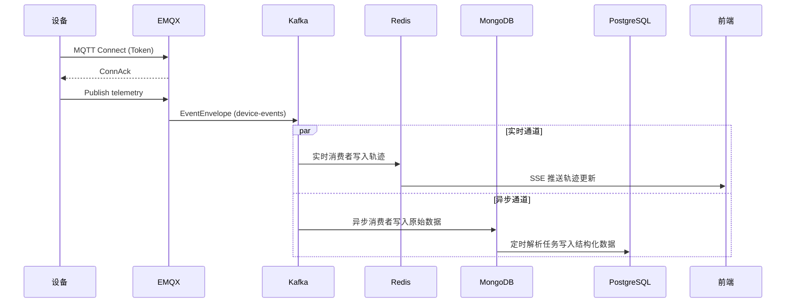

# Implementation Plan: Open-IoT MVP 核心功能

**Branch**: `001-mvp-core` | **Date**: 2026-02-25 | **Spec**: [spec.md](./spec.md)
**Input**: Feature specification from `/specs/001-mvp-core/spec.md`

## Summary

MVP 目标：在单环境中跑通可演示的端到端 IoT 数据链路，覆盖微服务治理、Kafka 消息驱动、Netty 高并发接入、多租户数据库设计四大核心能力。

**技术方案**：
- EMQX 作为 MQTT Broker
- 简化 Kafka 消费者处理实时数据（非 Flink）
- Redis 存储实时轨迹热数据，PostgreSQL 存储历史查询数据
- Token 设备认证
- 按时间窗口 + 手动触发的历史重放

---

## Technical Context

**Language/Version**: JDK 21 (LTS，支持虚拟线程)
**Primary Dependencies**: Spring Boot 3.x, Spring Cloud Alibaba, Kafka, Netty, MyBatis Plus, Sa-Token
**Storage**: PostgreSQL（主数据库）, MongoDB（原始事件）, Redis（实时状态/轨迹）
**Testing**: JUnit 5, Mockito, Testcontainers
**Target Platform**: Linux Server (Docker 容器化部署)
**Project Type**: 微服务 Web 应用
**Performance Goals**: >= 1000 并发设备连接, >= 2000 条/秒 Kafka 写入, P95 <= 3 秒实时延迟
**Constraints**: 单环境部署，无多集群容灾
**Scale/Scope**: 学习型项目，预计 <100 设备，<10 用户

---

## Constitution Check

*GATE: Must pass before Phase 0 research. Re-check after Phase 1 design.*

### I. 多租户强制原则 ✅

| 检查项 | 状态 | 说明 |
|--------|------|------|
| 核心业务表含 tenant_id | ✅ | Tenant, Device, ParsedData 等均包含 |
| 查询默认租户隔离 | ✅ | MyBatis Plus 拦截器实现 |
| 跨租户访问禁止 | ✅ | API 层 + 数据层双重校验 |

### II. 数据演进安全原则 ✅

| 检查项 | 状态 | 说明 |
|--------|------|------|
| Migration 工具 | ✅ | 使用 Flyway 管理 PostgreSQL Schema |
| 非破坏性修改 | ✅ | 设计阶段已考虑演进路径 |

### III. 渐进式微服务实践原则 ✅

| 检查项 | 状态 | 说明 |
|--------|------|------|
| 注册中心 | ✅ | Nacos |
| 配置中心 | ✅ | Nacos |
| API 网关 | ✅ | Spring Cloud Gateway |
| 服务拆分适度 | ✅ | 按业务域拆分 4 个核心服务 |

### IV. 协议可扩展原则 ✅

| 检查项 | 状态 | 说明 |
|--------|------|------|
| 协议层插件化 | ✅ | ProtocolAdapter 接口抽象 |
| 模型协议解耦 | ✅ | EventEnvelope 统一事件模型 |

### V. 垂直数据链路优先原则 ✅

| 检查项 | 状态 | 说明 |
|--------|------|------|
| 完整数据流 | ✅ | M1 阶段优先打通端到端 |
| 禁止 CRUD 优先 | ✅ | 先做数据链路，后做管理后台 |

### VI. 学习范围强制原则 ✅

| 检查项 | 状态 | 说明 |
|--------|------|------|
| 微服务治理 | ✅ | Nacos + Gateway |
| Kafka 消息驱动 | ✅ | 实时 + 异步双通道 |
| Netty 高并发 | ✅ | TCP 接入服务 |
| 多租户设计 | ✅ | 全链路 tenant_id |

**Constitution Check 结果**: ✅ 全部通过，无需 Complexity Tracking

---

## 总体技术架构

### 架构图

```
                                    ┌─────────────────────────────────────────────────────────┐
                                    │                      前端 (Vue3)                        │
                                    │   ┌──────────┐  ┌──────────┐  ┌──────────┐              │
                                    │   │ 设备监控  │  │ 轨迹展示  │  │ 租户管理  │              │
                                    │   └────┬─────┘  └────┬─────┘  └────┬─────┘              │
                                    └────────│─────────────│─────────────│───────────────────┘
                                             │             │             │
                                             ▼             ▼             ▼
                                    ┌─────────────────────────────────────────────────────────┐
                                    │              API Gateway (Spring Cloud Gateway)         │
                                    │   - 路由转发  - 鉴权  - 限流  - 日志(tenant_id,trace_id) │
                                    └────────────────────────────┬────────────────────────────┘
                                                                 │
                    ┌────────────────────────────────────────────┼────────────────────────────────────────────┐
                    │                                            │                                            │
                    ▼                                            ▼                                            ▼
        ┌───────────────────┐                        ┌───────────────────┐                        ┌───────────────────┐
        │   device-service   │                        │   data-service    │                        │  tenant-service   │
        │   (设备管理)        │                        │   (数据处理)       │                        │   (租户管理)       │
        │                   │                        │                   │                        │                   │
        │ - 设备 CRUD       │                        │ - 实时消费者       │                        │ - 租户 CRUD       │
        │ - 设备状态管理     │                        │ - 异步消费者       │                        │ - 用户认证        │
        │ - Token 鉴权      │                        │ - 解析任务调度     │                        │ - 权限校验        │
        └─────────┬─────────┘                        └─────────┬─────────┘                        └─────────┬─────────┘
                  │                                            │                                            │
                  └────────────────────────────────────────────┼────────────────────────────────────────────┘
                                                               │
                                        ┌──────────────────────┼──────────────────────┐
                                        │                      │                      │
                                        ▼                      ▼                      ▼
                              ┌─────────────────┐    ┌─────────────────┐    ┌─────────────────┐
                              │   PostgreSQL    │    │     Redis       │    │    MongoDB      │
                              │  (结构化数据)    │    │  (实时状态)      │    │  (原始事件)      │
              │  - 设备信息      │    │  - 设备在线状态  │    │  - RawEvents    │
                              │  - 解析结果      │    │  - 实时轨迹      │    │  - 死信队列      │
                              │  - 租户信息      │    │  - 会话缓存      │    │                 │
                              └─────────────────┘    └─────────────────┘    └─────────────────┘

        ═════════════════════════════════════════════════════════════════════════════════════════
                                        设备接入层
        ═════════════════════════════════════════════════════════════════════════════════════════

        ┌─────────────────────────────────┐        ┌─────────────────────────────────┐
        │         MQTT 设备               │        │         TCP 私有协议设备          │
        └───────────────┬─────────────────┘        └───────────────┬─────────────────┘
                        │                                          │
                        ▼                                          ▼
        ┌─────────────────────────────────┐        ┌─────────────────────────────────┐
        │      EMQX Broker                │        │   connect-service (Netty)       │
        │  - MQTT 3.1.1/5.0              │        │   - TCP 长连接                   │
        │  - 设备认证(Token)              │        │   - 私有协议解析                 │
        │  - Topic 订阅/发布              │        │   - Token 鉴权                  │
        └───────────────┬─────────────────┘        └───────────────┬─────────────────┘
                        │                                          │
                        └──────────────────┬───────────────────────┘
                                           │
                                           ▼
                              ┌─────────────────────────┐
                              │    Kafka (消息总线)      │
                              │  Topic: device-events   │
                              │  Topic: raw-events      │
                              │  Topic: dlq-parse       │
                              └─────────────┬───────────┘
                                            │
                          ┌─────────────────┼─────────────────┐
                          │                 │                 │
                          ▼                 ▼                 ▼
                   ┌────────────┐    ┌────────────┐    ┌────────────┐
                   │ 实时消费者  │    │ 异步消费者  │    │ 重放任务   │
                   │ (Redis)    │    │ (MongoDB)  │    │ (手动触发) │
                   └────────────┘    └────────────┘    └────────────┘

        ═════════════════════════════════════════════════════════════════════════════════════════
                                       基础设施层
        ═════════════════════════════════════════════════════════════════════════════════════════

        ┌─────────────────────────────────────────────────────────────────────────────────────┐
        │                              Nacos (注册中心 + 配置中心)                              │
        │   - 服务注册与发现  - 配置集中管理  - 动态配置推送                                      │
        └─────────────────────────────────────────────────────────────────────────────────────┘
```

---

## 服务清单与职责

| 服务名 | 职责 | 核心功能 | 依赖 |
|--------|------|---------|------|
| **gateway-service** | API 网关 | 路由转发、鉴权、限流、访问日志 | Nacos |
| **device-service** | 设备管理 | 设备 CRUD、状态管理、Token 鉴权 | PostgreSQL, Redis, Nacos |
| **connect-service** | 接入服务 | Netty TCP 接入、私有协议解析、Token 鉴权 | Kafka, Redis, Nacos |
| **data-service** | 数据处理 | 实时消费者、异步消费者、解析任务、重放 | Kafka, MongoDB, PostgreSQL, Redis, Nacos |
| **tenant-service** | 租户管理 | 租户 CRUD、用户认证、权限校验 | PostgreSQL, Redis, Nacos |
| **EMQX** | MQTT Broker | MQTT 协议接入、设备认证、消息订阅 | Kafka (通过 Rule Engine) |

### 服务依赖关系

```
                    ┌─────────────┐
                    │   Nacos     │ (注册中心 + 配置中心)
                    └──────┬──────┘
                           │
       ┌───────────────┬───┴───┬───────────────┬───────────────┐
       │               │       │               │               │
       ▼               ▼       ▼               ▼               ▼
┌──────────────┐ ┌──────────┐ ┌──────────┐ ┌──────────┐ ┌──────────────┐
│gateway-service│ │device-   │ │connect-  │ │data-     │ │tenant-service│
│              │ │service   │ │service   │ │service   │ │              │
└──────────────┘ └──────────┘ └──────────┘ └──────────┘ └──────────────┘
       │               │               │               │               │
       │               │               │               │               │
       ▼               ▼               ▼               ▼               ▼
   ┌───────┐       ┌───────┐       ┌───────┐       ┌───────┐       ┌───────┐
   │Redis  │       │PG+Redis│      │Kafka  │       │PG+MG+ │       │  PG   │
   │       │       │       │       │+Redis │       │Redis  │       │+Redis │
   └───────┘       └───────┘       └───────┘       └───────┘       └───────┘
```

---

## 仓库目录结构

```text
open-iot/
├── docs/                           # 项目文档
│   └── architecture/               # 架构文档
├── specs/                          # 功能规格
│   └── 001-mvp-core/
├── backend/                        # 后端服务
│   ├── pom.xml                     # 父 POM
│   ├── common/                     # 公共模块
│   │   ├── common-core/            # 核心工具类
│   │   ├── common-redis/           # Redis 配置
│   │   ├── common-kafka/           # Kafka 配置
│   │   ├── common-mongodb/         # MongoDB 配置
│   │   └── common-security/        # 安全认证
│   ├── gateway-service/            # API 网关服务
│   │   └── src/main/java/
│   │       └── com/openiot/gateway/
│   │           ├── config/         # 路由配置
│   │           ├── filter/         # 过滤器(鉴权/日志)
│   │           └── handler/        # 异常处理
│   ├── device-service/             # 设备管理服务
│   │   └── src/main/java/
│   │       └── com/openiot/device/
│   │           ├── controller/     # REST API
│   │           ├── service/        # 业务逻辑
│   │           ├── mapper/         # MyBatis Mapper
│   │           ├── entity/         # 实体类
│   │           └── dto/            # 数据传输对象
│   ├── connect-service/            # 设备接入服务
│   │   └── src/main/java/
│   │       └── com/openiot/connect/
│   │           ├── netty/          # Netty 服务
│   │           ├── protocol/       # 协议解析
│   │           ├── handler/        # 消息处理
│   │           └── auth/           # 设备认证
│   ├── data-service/               # 数据处理服务
│   │   └── src/main/java/
│   │       └── com/openiot/data/
│   │               ├── consumer/   # Kafka 消费者
│   │               ├── parser/     # 数据解析
│   │               ├── scheduler/  # 定时任务
│   │               └── replay/     # 历史重放
│   └── tenant-service/             # 租户管理服务
│       └── src/main/java/
│           └── com/openiot/tenant/
│               ├── controller/     # REST API
│               ├── service/        # 业务逻辑
│               └── security/       # 权限校验
├── frontend/                       # 前端应用
│   ├── package.json
│   ├── vite.config.ts
│   ├── src/
│   │   ├── main.ts
│   │   ├── App.vue
│   │   ├── api/                    # API 接口
│   │   ├── components/             # 通用组件
│   │   ├── views/                  # 页面视图
│   │   │   ├── device/             # 设备管理
│   │   │   ├── monitor/            # 实时监控
│   │   │   └── tenant/             # 租户管理
│   │   ├── stores/                 # Pinia 状态
│   │   ├── router/                 # 路由配置
│   │   └── utils/                  # 工具函数
│   └── public/
├── infrastructure/                 # 基础设施
│   ├── docker/                     # Docker 配置
│   │   ├── docker-compose.yml      # 开发环境编排
│   │   └── docker-compose.prod.yml # 生产环境编排
│   ├── emqx/                       # EMQX 配置
│   │   └── emqx.conf
│   ├── kafka/                      # Kafka 配置
│   │   └── server.properties
│   └── sql/                        # 数据库脚本
│       └── migrations/             # Flyway 迁移
├── scripts/                        # 脚本工具
│   ├── build.sh                    # 构建脚本
│   └── deploy.sh                   # 部署脚本
└── README.md
```

---

## 数据流与时序

### 实时通道数据流

```
┌──────────┐    ┌──────────┐    ┌──────────┐    ┌──────────┐    ┌──────────┐    ┌──────────┐
│  设备     │───▶│ EMQX/    │───▶│  Kafka   │───▶│ 实时消费者│───▶│  Redis   │───▶│  前端    │
│ (上报)   │    │ Netty    │    │ (events) │    │(data-svc)│    │ (轨迹)   │    │ (展示)  │
└──────────┘    └──────────┘    └──────────┘    └──────────┘    └──────────┘    └──────────┘
      │               │               │               │               │               │
      │   1.上报数据   │               │               │               │               │
      │──────────────▶│               │               │               │               │
      │               │  2.EventEnvelope              │               │               │
      │               │──────────────▶│               │               │               │
      │               │               │  3.消费处理   │               │               │
      │               │               │──────────────▶│               │               │
      │               │               │               │  4.写Redis    │               │
      │               │               │               │──────────────▶│               │
      │               │               │               │               │  5.SSE/WebSocket│
      │               │               │               │               │──────────────▶│
      │               │               │               │               │               │
      ▼               ▼               ▼               ▼               ▼               ▼
                                                                    P95 <= 3s
```

### 异步通道数据流

```
┌──────────┐    ┌──────────┐    ┌──────────┐    ┌──────────┐    ┌──────────┐    ┌──────────┐
│  设备     │───▶│ EMQX/    │───▶│  Kafka   │───▶│ 异步消费者│───▶│ MongoDB  │───▶│ 解析任务 │
│ (上报)   │    │ Netty    │    │(raw)     │    │(data-svc)│    │(原始)    │    │(定时)   │
└──────────┘    └──────────┘    └──────────┘    └──────────┘    └──────────┘    └──────────┘
                                                                      │
                                                                      │ 7.解析结果
                                                                      ▼
                                                               ┌──────────┐
                                                               │PostgreSQL│
                                                               │(结构化)  │
                                                               └──────────┘
```

### 时序图：MQTT 设备上报



---

## 数据存储设计

### PostgreSQL 表结构

```sql
-- 租户表
CREATE TABLE tenant (
    id BIGINT PRIMARY KEY AUTO_INCREMENT,
    tenant_code VARCHAR(50) NOT NULL UNIQUE,
    tenant_name VARCHAR(100) NOT NULL,
    contact_email VARCHAR(100),
    status CHAR(1) DEFAULT '1',
    delete_flag CHAR(1) DEFAULT '0',
    create_time TIMESTAMP DEFAULT CURRENT_TIMESTAMP,
    update_time TIMESTAMP DEFAULT CURRENT_TIMESTAMP,
    create_by BIGINT,
    update_by BIGINT
);

-- 设备表
CREATE TABLE device (
    id BIGINT PRIMARY KEY AUTO_INCREMENT,
    tenant_id BIGINT NOT NULL,
    device_code VARCHAR(50) NOT NULL,
    device_name VARCHAR(100),
    device_token VARCHAR(100) NOT NULL,
    protocol_type VARCHAR(20) NOT NULL,  -- MQTT/TCP/HTTP
    status CHAR(1) DEFAULT '1',
    delete_flag CHAR(1) DEFAULT '0',
    create_time TIMESTAMP DEFAULT CURRENT_TIMESTAMP,
    update_time TIMESTAMP DEFAULT CURRENT_TIMESTAMP,
    create_by BIGINT,
    update_by BIGINT,
    UNIQUE KEY uk_tenant_device (tenant_id, device_code)
);

-- 解析数据表（轨迹）
CREATE TABLE device_trajectory (
    id BIGINT PRIMARY KEY AUTO_INCREMENT,
    tenant_id BIGINT NOT NULL,
    device_id BIGINT NOT NULL,
    latitude DECIMAL(10, 7),
    longitude DECIMAL(10, 7),
    speed DECIMAL(5, 2),
    heading DECIMAL(5, 2),
    event_time TIMESTAMP NOT NULL,
    create_time TIMESTAMP DEFAULT CURRENT_TIMESTAMP,
    INDEX idx_tenant_device_time (tenant_id, device_id, event_time)
);

-- 索引
CREATE INDEX idx_device_tenant ON device(tenant_id);
CREATE INDEX idx_trajectory_time ON device_trajectory(event_time);
```

### MongoDB 集合

```javascript
// raw_events - 原始事件集合
{
  "_id": ObjectId,
  "tenantId": "string",          // 租户ID
  "deviceId": "string",          // 设备ID
  "eventType": "string",         // 事件类型：TELEMETRY/STATUS/ALARM
  "protocol": "string",          // 协议：MQTT/TCP/HTTP
  "rawPayload": "string",        // 原始载荷（Base64）
  "timestamp": ISODate,          // 事件时间
  "processed": false,            // 是否已处理
  "processResult": "string",     // 处理结果
  "createTime": ISODate
}

// dlq_events - 死信队列集合
{
  "_id": ObjectId,
  "originalEventId": "string",   // 原始事件ID
  "tenantId": "string",
  "deviceId": "string",
  "rawPayload": "string",
  "failureReason": "string",     // 失败原因
  "retryCount": 0,               // 重试次数
  "createTime": ISODate,
  "lastRetryTime": ISODate
}
```

### Redis 数据结构

```
# 设备在线状态
device:status:{tenantId}:{deviceId} = {
  "online": true,
  "lastSeen": 1709012345678,
  "ip": "192.168.1.100"
}
TTL: 300s (5分钟无心跳自动过期)

# 实时轨迹（最近N个点）
device:trajectory:{tenantId}:{deviceId} = [
  {"lat": 30.5, "lng": 120.1, "ts": 1709012345678},
  {"lat": 30.51, "lng": 120.11, "ts": 1709012345780}
]
TYPE: ZSET (按时间戳排序)
MAX: 100 (保留最近100个点)

# 设备 Token 缓存
device:token:{token} = {tenantId, deviceId, expireTime}
TTL: 根据Token有效期设置
```

---

## API 与事件契约

### REST API 契约

#### 设备管理 API

```yaml
# POST /api/v1/devices - 创建设备
Request:
  deviceCode: string (required)
  deviceName: string
  protocolType: MQTT | TCP | HTTP (required)
Response:
  code: 200
  msg: "success"
  data:
    id: number
    deviceCode: string
    deviceToken: string  # 返回Token用于设备认证

# GET /api/v1/devices - 设备列表
Request:
  page: number
  size: number
  status: string (optional)
Response:
  code: 200
  data:
    total: number
    list:
      - id: number
        deviceCode: string
        deviceName: string
        protocolType: string
        status: string
        onlineStatus: ONLINE | OFFLINE
        lastSeenTime: string

# GET /api/v1/devices/{id}/trajectory - 获取轨迹
Request:
  startTime: string (ISO8601)
  endTime: string (ISO8601)
Response:
  code: 200
  data:
    - latitude: number
      longitude: number
      speed: number
      heading: number
      eventTime: string
```

#### 数据上报 API

```yaml
# POST /api/v1/devices/data - HTTP 设备上报
Headers:
  X-Device-Token: string (required)
Request:
  eventType: TELEMETRY | STATUS
  payload: object
  timestamp: string (ISO8601)
Response:
  code: 200
  msg: "success"
```

### Kafka Topic 契约

```yaml
# device-events - 统一事件Topic
Topic: device-events
Key: {tenantId}:{deviceId}
Value:
  eventId: string (UUID)
  tenantId: string
  deviceId: string
  eventType: TELEMETRY | STATUS | ALARM
  protocol: MQTT | TCP | HTTP
  payload: object  # 解析后的数据
  rawPayload: string  # 原始载荷(Base64)
  timestamp: number (epoch millis)
  traceId: string  # 链路追踪ID

# raw-events - 原始事件Topic（用于异步持久化）
Topic: raw-events
Key: {tenantId}:{deviceId}
Value:
  eventId: string
  tenantId: string
  deviceId: string
  protocol: string
  rawPayload: string
  timestamp: number

# dlq-parse - 死信队列Topic
Topic: dlq-parse
Key: eventId
Value:
  eventId: string
  originalEvent: object
  failureReason: string
  retryCount: number
  failedAt: number
```

### EventEnvelope 结构

```java
public class EventEnvelope {
    private String eventId;       // UUID
    private String tenantId;      // 租户ID
    private String deviceId;      // 设备ID
    private String eventType;     // TELEMETRY/STATUS/ALARM
    private String protocol;      // MQTT/TCP/HTTP
    private Object payload;       // 解析后的业务数据
    private String rawPayload;    // 原始载荷(Base64)
    private Long timestamp;       // 事件时间戳
    private String traceId;       // 链路追踪ID
}
```

---

## 分阶段里程碑

### M1: 基础设施 + 端到端数据链路（2周）

**目标**: 跑通最简端到端链路，验证架构可行性

**范围**:
- Nacos 注册中心/配置中心
- Spring Cloud Gateway 网关
- PostgreSQL + Redis 基础表结构
- MQTT 设备通过 EMQX 上报 → Kafka → Redis → 前端展示

**验收标准**:
- [ ] Nacos 控制台可见所有服务
- [ ] 通过网关访问 API 成功
- [ ] MQTT 设备上报数据，前端 5 秒内可见轨迹点
- [ ] 租户隔离验证通过

**交付物**:
- docker-compose 开发环境
- gateway-service、device-service、data-service 骨架
- 前端设备监控页面基础版

---

### M2: 多协议接入 + 异步通道（2周）

**目标**: 完善 TCP/HTTP 接入，实现异步持久化与解析

**范围**:
- Netty TCP 接入服务
- HTTP 设备上报 API
- MongoDB 原始事件存储
- 异步消费者 + 定时解析任务
- 死信队列 + 重试机制

**验收标准**:
- [ ] TCP 设备通过 Netty 接入成功
- [ ] HTTP 云设备上报成功
- [ ] 原始数据落 MongoDB
- [ ] 解析结果写入 PostgreSQL
- [ ] 解析失败进入死信队列，可手动重试

**交付物**:
- connect-service 完整实现
- data-service 异步处理链路
- 死信队列管理界面

---

### M3: 完善与优化（1周）

**目标**: 完善管理功能，优化性能，准备演示

**范围**:
- tenant-service 租户管理
- 前端完善（租户管理、设备管理、轨迹回放）
- 历史重放功能
- 性能优化（连接池、批量写入）
- 文档完善

**验收标准**:
- [ ] 租户 CRUD 完整
- [ ] 平台管理员/租户管理员权限隔离
- [ ] 历史轨迹回放功能可用
- [ ] 1000 并发设备连接测试通过
- [ ] 实时轨迹 P95 延迟 <= 3 秒

**交付物**:
- 完整前后端代码
- 部署文档
- 演示 Demo

---

## 风险与降级方案

| 风险 | 影响 | 概率 | 降级方案 |
|------|------|------|---------|
| EMQX Rule Engine 对接 Kafka 复杂 | 高 | 中 | 改用 EMQX Webhook + HTTP 接收服务 |
| Netty 高并发连接数不达标 | 中 | 低 | 优化线程模型，增加连接超时机制 |
| MongoDB 写入瓶颈 | 中 | 低 | 异步批量写入，控制写入频率 |
| Redis 内存不足 | 中 | 低 | 限制轨迹点数量，启用淘汰策略 |
| Kafka 消费延迟 | 中 | 中 | 增加消费者实例，优化消费逻辑 |
| 多租户隔离遗漏 | 高 | 低 | Code Review + 自动化测试覆盖 |

---

## 本阶段不做项

| 项目 | 原因 | 后续规划 |
|------|------|---------|
| 多集群容灾 | MVP 单环境验证 | M4+ |
| Flink 实时计算 | 简化消费者满足需求 | 按需引入 |
| 证书双向认证 | Token 认证足够 | M4+ |
| 复杂规则引擎 | 简单解析足够 | M5+ |
| 告警通知 | 非核心链路 | M4+ |
| OTA 升级 | 非核心功能 | M5+ |
| 计费系统 | 学习型项目不需要 | 不做 |
| 大规模压测 | MVP 验证架构 | M4+ |

---

## Documentation (this feature)

```text
specs/001-mvp-core/
├── plan.md              # 本文件
├── research.md          # Phase 0 输出
├── data-model.md        # Phase 1 输出
├── quickstart.md        # Phase 1 输出
├── contracts/           # Phase 1 输出
│   ├── api.yaml         # REST API 契约
│   └── events.yaml      # Kafka 事件契约
└── tasks.md             # Phase 2 输出 (/speckit.tasks)
```
